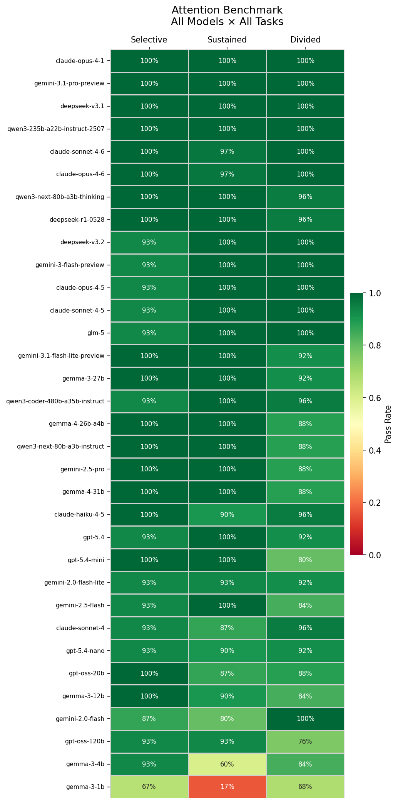

# Attention Benchmark for AGI Evaluation

A benchmark submitted to the **Google DeepMind x Kaggle AGI Benchmark Hackathon** that evaluates language model attentional control across three cognitive tasks drawn from human neuropsychology. Rather than testing factual recall or reasoning in isolation, this benchmark probes whether a model can direct, sustain, and divide its attention, core faculties in AGI evaluation.

The benchmark notebooks run across all 33 models available in the Kaggle environment and use a fixed judge for consistent cross-model scoring. Task notebooks are also included for single-model evaluation via the Kaggle task runner.

> **Environment note:** The submission notebooks are designed to run inside the **Kaggle notebook environment**, where `kaggle-benchmarks` is pre-installed and `kbench.llm`, `kbench.judge_llm`, and `kbench.llms` are auto-configured via injected credentials. They cannot make live API calls outside that environment.

> **LLM Usage:** Claude Code was used throughout this project as a development assistant, primarily for code tuning, implementation debugging, and refining task criteria wording. Task design, scenario selection, and all analytical judgements are my own.

---

## Tasks

### Selective Attention
The model is given a passage with deliberately embedded distractors and must extract only goal-relevant information, ignoring content that is irrelevant to the target question.

*Example:* A clinical note mixing vital signs with personal anecdotes. The model must report the clinical observations only.

### Sustained Attention
The model must track and aggregate specific targets accurately across a sequential context of up to 15 records, without skipping entries, approximating, or losing count midway.

*Example:* 15 financial transactions involving multiple parties. The model must calculate one person's exact net balance, showing all working.

### Divided Attention
The model is given two independent information streams and must simultaneously monitor and reason across both, keeping each stream's facts correctly attributed without conflation.

*Example:* Log files from two servers running in parallel. The model must report error counts per server and identify which error type appeared on both.

---

## Evaluation Design

Each notebook runs across all models available in the Kaggle environment (`kbench.llms`, 33 models evaluated) using a fixed judge model (`kbench.judge_llm`) to score every response. Using a fixed judge rather than self-evaluation eliminates the bias of each model grading its own output, making scores directly comparable across models.

Each task uses 5 judge-evaluated criteria per scenario. Scenario counts differ across tasks because each was calibrated to the configuration that maximized performance discrimination: additional scenarios improved spread for sustained and divided attention but compressed it for selective attention. Pass rates are used for all cross-task comparisons.

| Task | Scenarios | Assertions per scenario | Total per model | Notes |
|---|---|---|---|---|
| Selective Attention | 3 | 5 judge criteria | 15 | |
| Sustained Attention | 5 | 5 judge criteria + 1 regex hard-check | 30 | regex verifies the final numeric answer independently of the judge |
| Divided Attention | 5 | 5 judge criteria | 25 | |

---

## Results

Evaluated across 33 models in the Kaggle environment. Full per-model breakdowns are available in the `results/` CSVs and in the executed notebooks.

> **Note:** LLM outputs are non-deterministic and no random seed can be set for hosted models. Pass rates may vary slightly across runs. The figures below reflect a single full evaluation run.

| Task | Models | Avg Pass Rate | Top Score | Bottom Score |
|---|---|---|---|---|
| Selective Attention | 33 | 96.0% | 100% (18 models) | 66.7% |
| Sustained Attention | 33 | 93.3% | 100% (21 models) | 16.7% |
| Divided Attention | 33 | 92.6% | 100% (12 models) | 68.0% |



**Key findings:**

- Divided attention is the strongest discriminator: 8 distinct performance levels, a 32pp spread (100% to 68%), and only 12 of 33 models at a perfect score. It is the only task where a model's score meaningfully separates it from peers at the same capability tier.
- Selective attention is well-calibrated at 4 distinct levels (100% to 66.7%), with 18 of 33 models at a perfect score and 13 more at 93.3%. The spread is real but compressed near the top.
- Sustained attention shows strong discrimination: 21 of 33 models scored 100% and 8 distinct performance levels span 83 percentage points (100% to 16.7%). The harder tracking scenarios expose real differences among frontier models while still clearly identifying small-model failure at the bottom.
- Only 4 models scored 100% across all three tasks: `claude-opus-4-1`, `deepseek-v3.1`, `gemini-3.1-pro-preview`, and `qwen3-235b-a22b-instruct-2507`.
- Divided attention reveals capability gaps invisible in the other tasks. `gpt-5.4-mini` (80%), `gemini-2.5-pro` (88%), `gemma-4-26b-a4b` (88%), and `gemma-4-31b` (88%) all score 100% on both selective and sustained, yet drop significantly on divided, suggesting a specific weakness in simultaneous multi-stream reasoning. `gpt-oss-120b` (76%) shows the steepest divided attention drop despite near-perfect scores on the other two tasks.
- `gemma-3-1b` is the consistent low outlier across all three tasks (66.7% / 16.7% / 68.0%). Its steepest drop remains on sustained attention, where the harder tracking scenarios expose its limits most clearly.
- `gemini-2.0-flash` scores 100% on divided and 80% on sustained while scoring only 86.7% on selective, suggesting relative strength in multi-stream reasoning tasks versus sequential tracking and single-passage distractor filtering.
- Per-criterion analysis pinpoints the exact failure modes. In divided attention, halt cause attribution in the factory scenario drives the majority of failures: 15 of 33 models failed to correctly attribute Factory B's supply delay halt, and 14 of 33 failed Factory A's equipment calibration halt, the two highest individual criterion failure rates in the entire benchmark. Output and defect counts on the same scenario failed in only 2 and 1 models respectively, confirming the challenge is attribution under concurrent load, not arithmetic.
- In selective attention, 13 of 33 models failed a single criterion: not mentioning the lead researcher's hiking hobby in the research study scenario. This one distractor accounts for nearly all of selective attention's failures and reflects a specific model behavior: summarizing the full passage context rather than filtering to the task-relevant content.
- In sustained attention, the customer support ticket log (row 4) is the hardest scenario: 6 of 33 models failed to correctly identify Morgan's resolved and unresolved ticket counts, with errors cascading into the unresolved percentage (5/33) and average resolution time (4/33). The payroll register (row 2) produced only 5 judge failures spread evenly across criteria, the easiest scenario in the task. The regex hard-check on the Alice net balance (row 0) flagged 6 models that produced incorrect final answers despite passing some judge criteria, confirming the dual-assertion design catches errors the judge alone would miss.

---

## Tech Stack

| Tool | Role |
|---|---|
| `kaggle-benchmarks` | Task definition, LLM access via `kbench.llm`, assertion framework |
| `pandas` | TASK_DATA definition and results aggregation |

---

## Repo Structure

```
.
├── notebooks/
│   ├── attention_benchmark_visualizations.ipynb # heatmap + score distributions from results CSVs
│   ├── divided_attention_benchmark.ipynb        # benchmark: runs all models, visual output
│   ├── divided_attention_task.ipynb             # task runner: single model via kbench.llm
│   ├── selective_attention_benchmark.ipynb
│   ├── selective_attention_task.ipynb
│   ├── sustained_attention_benchmark.ipynb
│   └── sustained_attention_task.ipynb
├── results/
│   ├── attention_distributions.png
│   ├── attention_heatmap.png
│   ├── divided_attention_results.csv
│   ├── divided_attention_detailed_results.csv
│   ├── selective_attention_results.csv
│   ├── selective_attention_detailed_results.csv
│   ├── sustained_attention_results.csv
│   └── sustained_attention_detailed_results.csv
├── CLAUDE.md
├── README.md
└── PROGRESS.md
```
